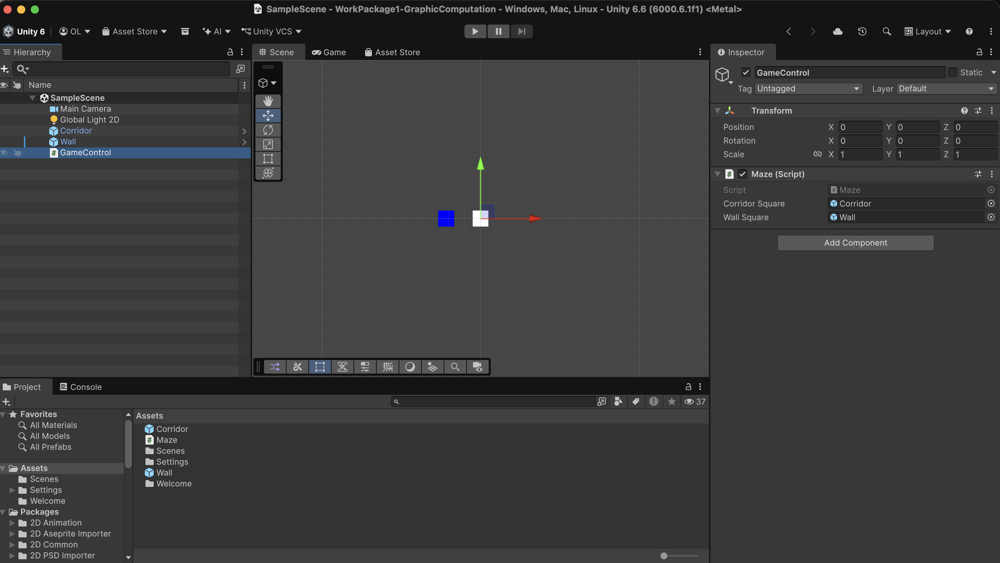
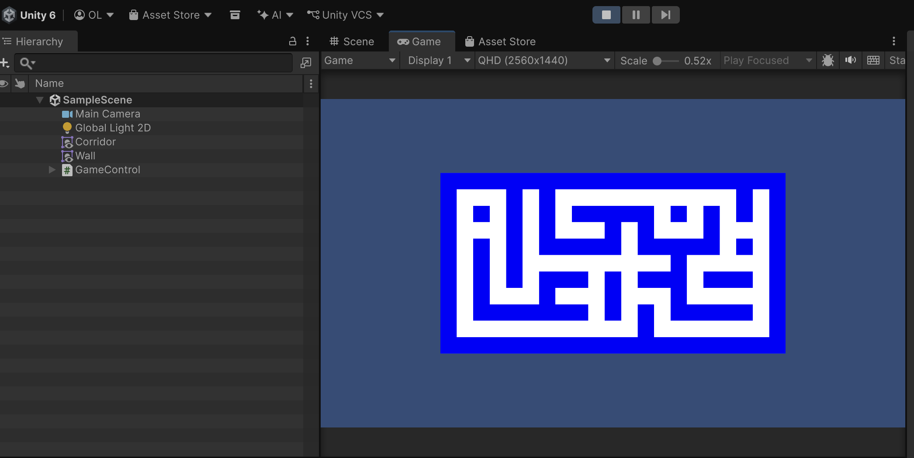
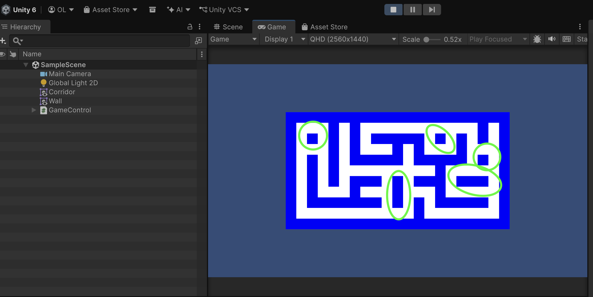
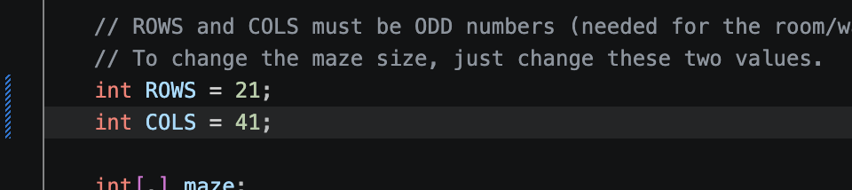
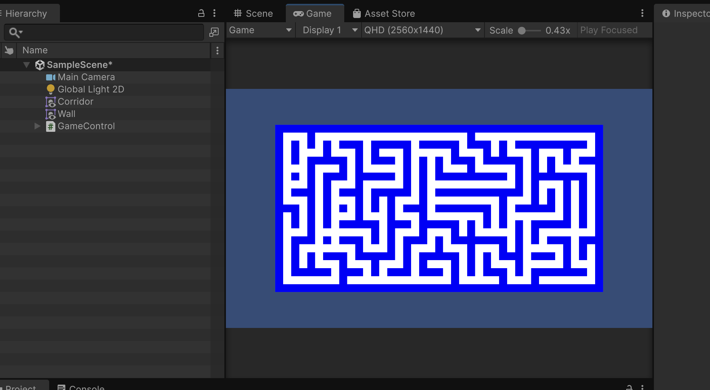
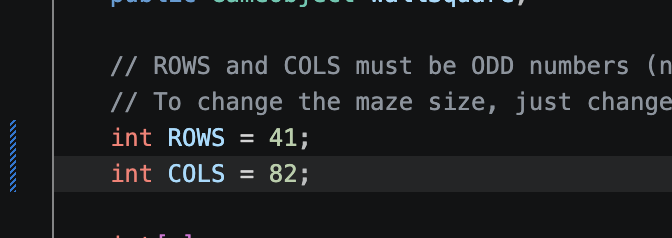
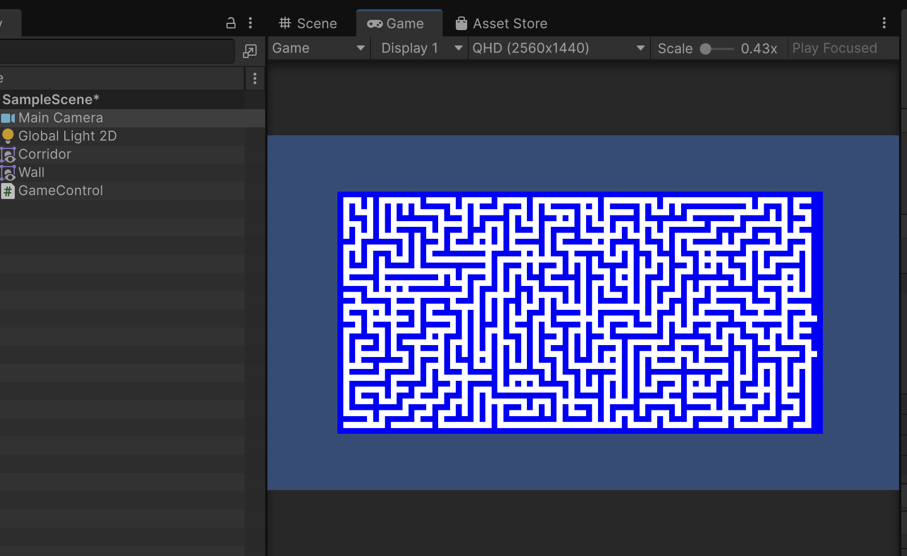
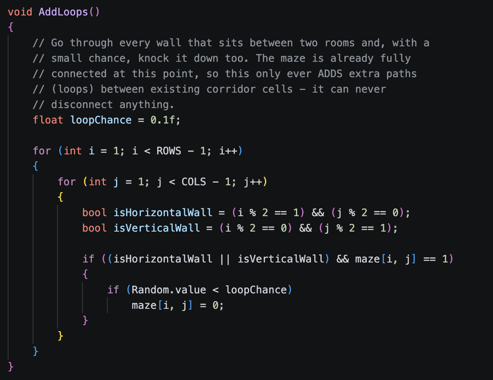
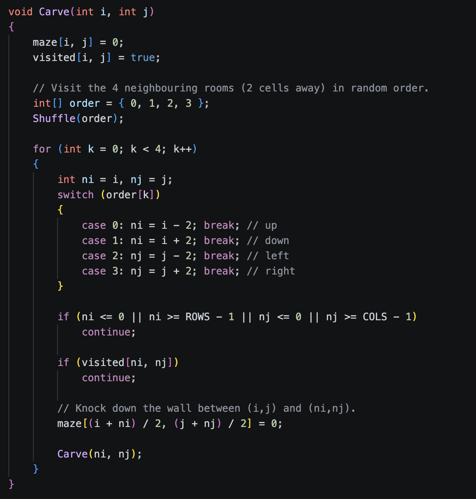

# Work Package 1: Graphic Computation
## Task 1: Random Maze Generation in Unity

**Course:** Computer Graphics and Multimedia  
**Subject:** Work Package 1 - Graphic Computation  
**Task:** Generate a random maze and document the result  

---

## 1. Objective

The purpose of this task is to extend the `Maze.cs` script so that it generates and displays a random maze in Unity while satisfying the following requirements:

1. The maze must be connected, meaning every corridor cell must be reachable from any other corridor cell.
2. The maze size must be easy to modify by changing the number of rows and columns.
3. The maze must contain loops, meaning it is not a strict tree-like structure.

This implementation was developed in Unity and validated through runtime execution and screenshot-based verification.

---

## 2. Implementation Summary

The solution is based on a 2D grid representation where each cell is either a wall or a corridor. The algorithm begins by initializing the grid as a full wall matrix, then creates a random spanning tree using a randomized depth-first traversal. This guarantees connectivity because every corridor is visited and connected to the previous one via carved passages.

After that, a secondary step removes a limited number of internal walls with a small probability to introduce loops without disconnecting the maze. This produces a maze that remains connected but includes alternative paths.

The size of the maze is controlled by the integer variables `ROWS` and `COLS`, which can be easily modified at the top of the script.

---

## 3. Technical Details

### 3.1 Grid Representation

The maze uses a discrete matrix of cells:

- `0` = corridor cell
- `1` = wall cell

The generation is performed on odd-sized grids, which is necessary for the room-and-wall logic used by the carving algorithm.

### 3.2 Connectivity Guarantee

The connectivity is ensured by the recursive backtracking method:

- a random starting cell is selected,
- neighboring cells are visited in random order,
- the wall between cells is removed when a new corridor is reached,
- this process continues until every reachable cell has been visited.

This creates a spanning tree, which guarantees that all corridor cells are connected.

### 3.3 Loop Generation

The loop generation process is implemented in `AddLoops()`. It scans walls that are possible candidates for creating additional paths and removes them with a low probability. This adds extra routes while preserving overall connectivity.

### 3.4 Runtime Regeneration

The script can regenerate a new random maze while the game is running by pressing the **Spacebar**. This makes it easy to verify that the maze is always connected and visually different.

---

## 4. Code Reference

```csharp
int ROWS = 11;
int COLS = 21;

void SetMap()
{
    InitMaze();
    BuildRandomMaze();
    DrawMaze();
}
```

The main logic is implemented in the following functions:

- `Carve()` — creates the connected maze structure using randomized DFS.
- `AddLoops()` — adds cycles/loops to the maze.
- `DrawMaze()` — instantiates the wall and corridor prefabs in Unity.

---

## 5. Snapshot Requirements for the PDF Document

The document must include the following screenshots in the order shown below. These images demonstrate that the task was completed and that the implementation meets the stated requirements.

### Snapshot 1: Unity Inspector and Scene Hierarchy

Place this image in the report as the first visual proof of the setup.

It must show:
- the Unity `Hierarchy` panel,
- the `Inspector` panel,
- the `Maze.cs` component attached to the GameObject,
- the references to the corridor and wall prefabs.



*Figure 1: Unity Editor setup showing the Maze GameObject and the attached corridor/wall prefab references.*

---

### Snapshot 2: Default Generated Maze

This image should be placed immediately after the setup figure.

It must show:
- the generated maze in runtime,
- the default size of the maze,
- a clear distinction between corridors and walls.



*Figure 2: Default generated maze with dimensions 11 × 21, showing a connected corridor structure and clear wall separation.*

---

### Snapshot 3: Evidence of Loops

This screenshot must show a close-up or a highlighted area where a loop is visible.

It must demonstrate:
- that the maze is not a strict tree,
- that there are alternative routes between corridor cells,
- that loops were intentionally added after the spanning tree was created.



*Figure 3: Close-up showing a loop inside the maze, demonstrating that alternative paths exist between corridor cells.*

---

### Snapshot 4: Dimension Scalability Test

This section should include the images showing the maze with different sizes.

It must show:
- one configuration with altered `ROWS` and `COLS`,
- a second configuration with a larger maze,
- correct connectivity in both cases.






*Figure 4: Maze scalability tests with different dimensions, demonstrating that the generation remains valid and connected for larger grids.*

---

### Snapshot 5: Code Implementation in the IDE

This final figure should show the relevant code in the editor.

It must contain:
- the `Carve()` function,
- the `AddLoops()` function,
- the configuration variables `ROWS` and `COLS`.




*Figure 5: Source code implementation showing the randomized maze carving algorithm and the loop-generation logic.*

---

## 6. Additional Contribution


*Figure 6: Generated maze showing the green entrance and red exit markers.*

---

## 7. Requirement Compliance Summary

| Requirement | Evidence in the implementation | Status |
| :--- | :--- | :--- |
| Connected maze | Randomized DFS carving generates a spanning tree | Completed |
| Easy modification of dimensions | `ROWS` and `COLS` are defined as simple integer variables | Completed |
| Includes loops | `AddLoops()` removes selected internal walls with low probability | Completed |
| Runtime validation | Pressing `Spacebar` regenerates a new maze | Completed |
| Entrance and exit markers | Green and red corridor cells identify the maze endpoints | Additional contribution |


